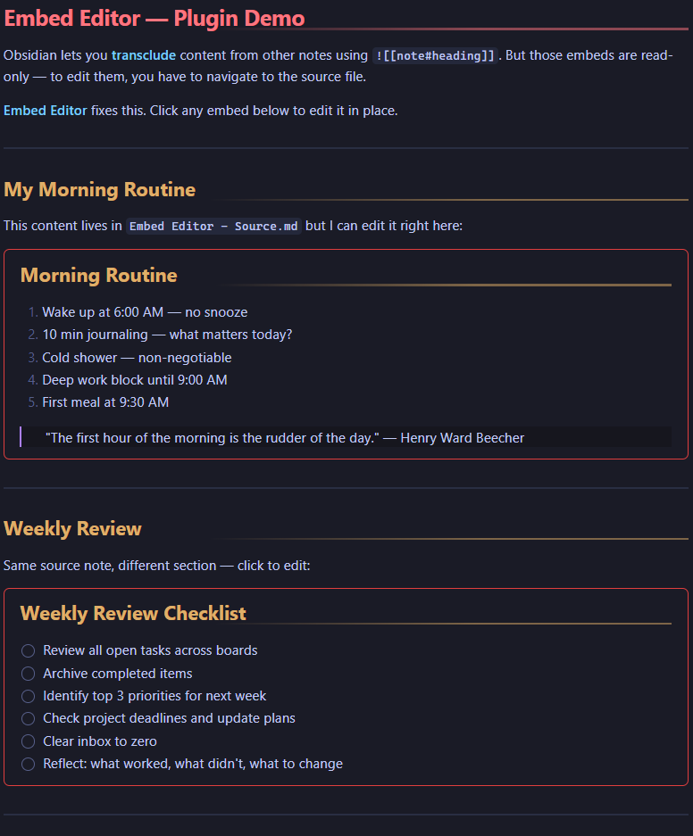
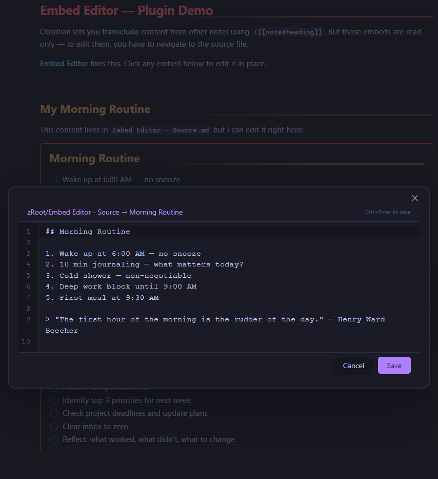

# Embed Editor for Obsidian

**Notion-style synced blocks for Obsidian.** Click any transcluded embed (`![[]]`) to edit its source content in a floating panel — no more navigating away from your current note.

Obsidian's transclusion (`![[note]]`, `![[note#heading]]`, `![[note#^block]]`) lets you display content from other notes inline. But editing that content requires navigating to the source file first. **Embed Editor** closes that gap: click the embed, edit in place, save — the source file and all embeds update instantly.

**Click any embed to open the floating editor:**

---

## Features

- **Click-to-edit** — Click any transcluded embed to open a floating editor panel
- **All transclusion types** — Works with full notes (`![[note]]`), heading sections (`![[note#heading]]`), and block references (`![[note#^blockid]]`)
- **Source-view editor** — Line numbers, monospace font, tab support — styled to match Obsidian's native editor
- **Keyboard shortcuts** — `Ctrl/Cmd+Enter` to save, `Escape` to cancel
- **Unsaved changes indicator** — Blue dot appears when you've made edits
- **Click source link** — Header shows the source file path; click it to navigate to the source note
- **Hover hints** — Embeds show a subtle outline on hover so you know they're clickable
- **Theme-aware** — Inherits all colors from your current Obsidian theme
- **Canvas-safe** — Does not affect Canvas card styling

## Bonus: Seamless Embeds CSS Snippet

The repo includes `seamless-embeds.css` — a CSS snippet that makes transclusions look like native content instead of boxed embeds:

- Removes the default embed border, title bar, link icon, and scroll container
- Adds a clean red border frame (similar to Notion's synced blocks)
- Scoped to markdown views only — does **not** affect Canvas

## Installation

### Manual Install

1. Download `main.js`, `manifest.json`, and `styles.css` from the [latest release](../../releases/latest)
2. Create a folder called `embed-editor` in your vault's `.obsidian/plugins/` directory
3. Copy the three files into that folder
4. Open Obsidian → Settings → Community plugins → Reload → Enable "Embed Editor"

### CSS Snippet (optional)

1. Download `seamless-embeds.css` from the [latest release](../../releases/latest)
2. Copy it to your vault's `.obsidian/snippets/` directory
3. Open Obsidian → Settings → Appearance → CSS Snippets → Refresh → Enable "seamless-embeds"

## Usage

1. Add a transclusion anywhere in your notes: `![[Some Note#Some Heading]]`
2. In Reading View or Live Preview, **click** the embedded content
3. A floating editor opens with the source text
4. Edit the content, then press **Ctrl+Enter** to save (or click the Save button)
5. The source file updates and the embed refreshes automatically

### Keyboard Shortcuts

| Shortcut | Action |
|---|---|
| `Ctrl/Cmd + Enter` | Save and close |
| `Escape` | Cancel and close |
| `Tab` | Insert tab character |

## How It Works

Embed Editor registers a click handler on embed elements. When you click:

1. It resolves the embed's source file and subpath (heading or block reference)
2. Reads the source file and extracts the relevant lines
3. Opens a modal with an editor pre-filled with that content
4. On save, it splices your edits back into the exact line range in the source file
5. Obsidian's built-in reactivity re-renders the embed with the updated content

The plugin uses Obsidian's metadata cache for heading lookups and the Vault API for file reads/writes — no external dependencies.

## Compatibility

- Obsidian v1.0.0+
- Desktop and mobile
- Works with any Obsidian theme (inherits CSS variables)
- Does not conflict with Canvas views

## License

[MIT](LICENSE)
